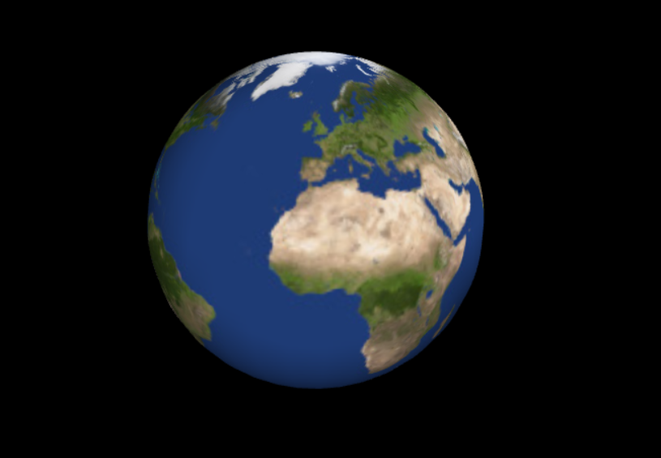
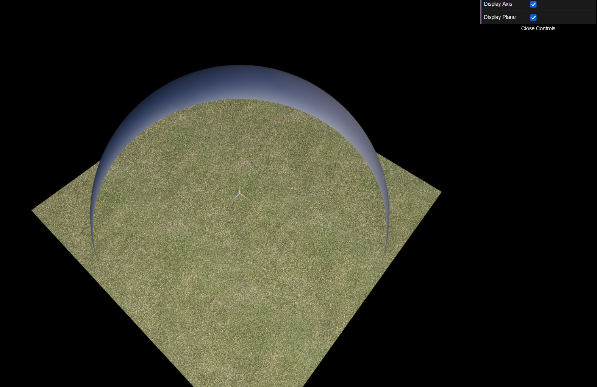
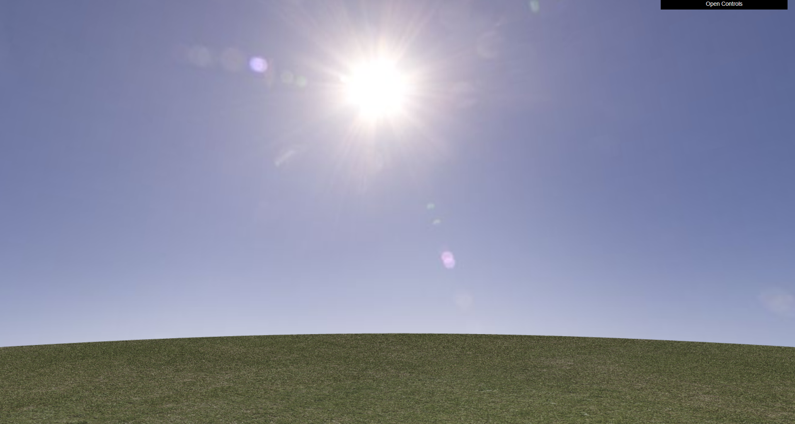
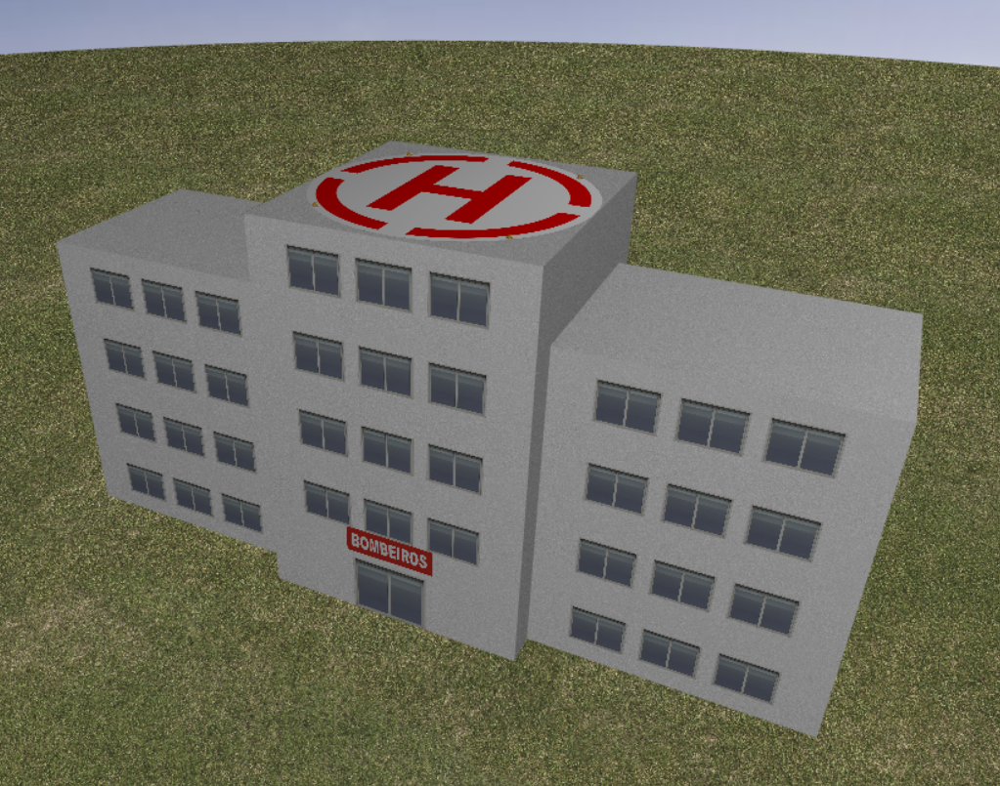
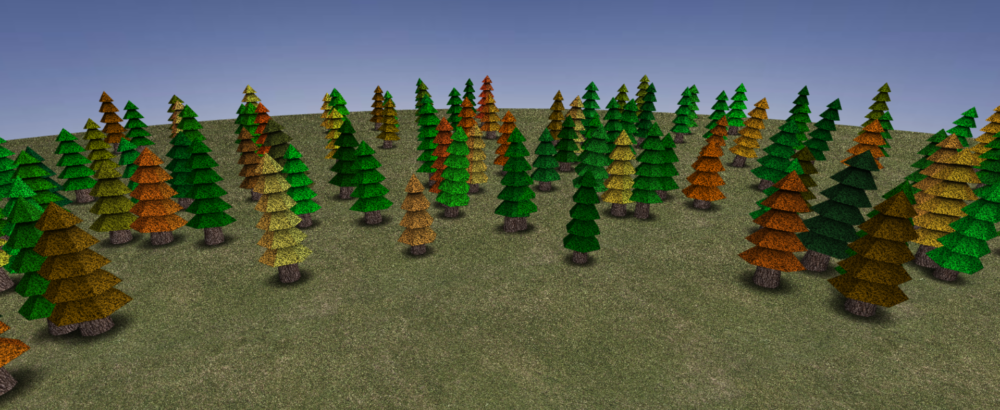
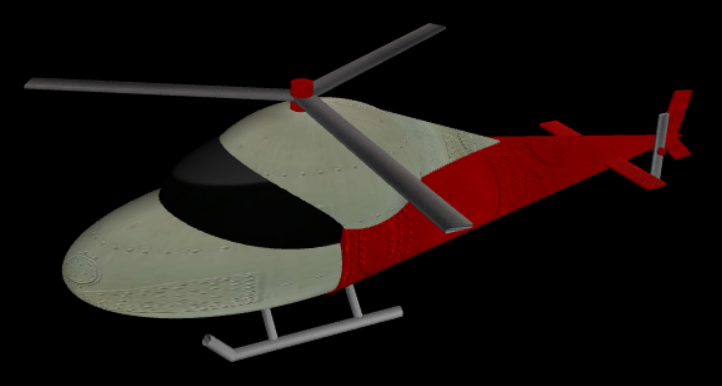
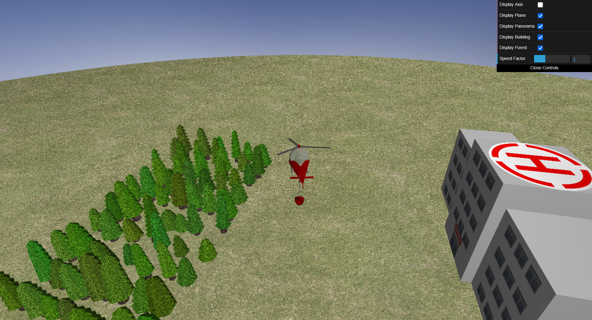
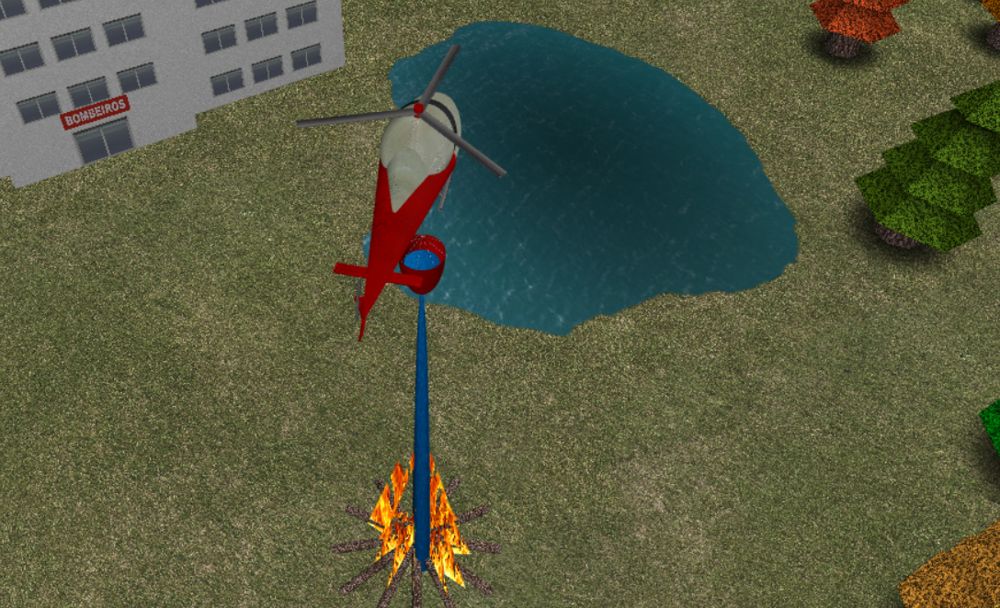

# CG 2024/2025

## Group T03G02

| Name             | Number    | E-Mail             |
| ---------------- | --------- | ------------------ |
| Gabriel Carvalho | 202208939 | up202208939@up.pt  |
| Vasco Melo       | 202207564 | up202207564@up.pt  |

## Project Documentation

### Proj-1: Earth Sphere

The earth sphere was created using the UV sphere creation algorithm, which is a common method for generating spherical shapes in 3D graphics. The sphere is generated by sweeping latitude (stacks) and longitude (slices) angles, mapping a grid of points (using spherical coordinates) onto the sphere's surface.

#### Sphere Image:



### Proj-2: Panorama

We decided to re-use the earth sphere from the first delivery for the panorama. To achieve this we added a boolean parameter to the sphere creation function that would alter the texture coordinates of the sphere to map a panorama image inside the sphere instead of the outside. This allows us to create a panoramic view by applying a texture that wraps around the inside of the sphere, giving the illusion of being inside a large spherical environment.

**Additional Notes:** 

Although the guides mentions that the panorama should follow the three axis of the camera, since following the y axis would break the illusion due to the constant change of the horizon line, we decided to only follow the x and z axes. This way, the panorama will always be aligned with the horizon line, providing a more realistic experience.

We also increased MyPlane's size to 600x600 instead of 400x400. This change was made to increase the amount of space that the helicopter can move around the panorama before the illusion is broken by the helicopter reaching the edge of the plane (out of bounds).

These decisions were backed by our practical lessons professor, who confirmed that these approaches are acceptable for the project.

#### Panorama Images:

Outside View:



Inside View: 



### Proj-3: FireFighters Building

The FireFighters Building was created using three objects of the class MyModule. This class received as parameters the necessary information for the creation of the building, such as the width and length, but also the number of floors, the number of windows per floor, and the color of the module. Finally, it also received a boolean parameter that would determine whether the building was the center module or not. If it was the center module, an additional floor would be added to the building, as well as a door and a heliport on the roof.

**Additional Notes:**

It was at this point we decided to use:

``` js
this.gl.enable(this.gl.BLEND);
this.gl.enable(this.gl.BLEND);
this.gl.blendFuncSeparate(
    this.gl.SRC_ALPHA,
    this.gl.ONE_MINUS_SRC_ALPHA,
    this.gl.ONE,
    this.gl.ONE
);
```

In order to allow transparency in our textures, which will help in the placement of the heliport, as well as the tree shadows, and the fire later on in the project.

#### FireFighters Building Image:


### Proj-4: Forest

The Forest was created following the exact instructions given in the project guide. Some notable features include the use of MyPyramid instead of a six slices MyCone, which allows for a more precise texture coordinate mapping, helping with the shadow textures we applied to different parts of the tree leaves(top leaves, middle leaves, and bottom leaves). We also applied a shadow bellow each tree to help the forest blend in with the ground. For the tree color, we used a method where a random base color was selected and then a random value was added to the RGB values of the base color to create a more natural variation in the tree colors.

**Additional Notes:** 

In order to populate the scene we used two forests that alternated and rotated around the center of the scene. It is important to note that due to a random offset being applied to the tree's position, trees from different MyForest objects may overlap, or the bottom shadow of trees in proximity of each other may have z-fighting issues.

#### Forest Image:


### Proj-5: Helicopter

The helicopter was built using the following objects:

- Three `MyEllipsoid` objects for the main body and cockpit;
- Two `MyCone` objects for the tail;
- The landing gear was made using `MyCylinder` objects;
- The two rotors and tail stabilizer were made using four slices `MyCylinder` objects;
- The bucket was made using a `MySemiSphere` object and the cables were made using `MyCylinder` objects;

The helicopter follows the instructions given in the guide, with the exception of the **S** key, and has the following controls:

- **W**: Accelarate and move forward;
- **S**: Decelerate and move backward (in the guide it states that it is only supposed to decelerate, but we found that it was more intuitive to also move backward);

****
- **A**: Rotate left;
- **D**: Rotate right;

****
- **P**: Lift off from building (deploy bucket) or lake;
- **L**: Land on building (retract bucket) or lake; 

****
- **O**: Open bucket valve and drop water on the fire;

****
- **R**: Reset the scene;

In regards to the camera position while flying, we decided to have the camera follow both the helicopter's position and rotation, with a slight offset to give a better view of the helicopter sides and bucket, as well as the ground bellow.

**Additional Notes:**

Due to the sheer amount of trees in MyScene, computers that lack the computational power to handle the scene may experience a drop in performance during the flight of the helicopter. If this happens, we recomend turning the forest off using the check box in the GUI, and experimenting with new values for `this.setUpdatePeriod(millis)` in MyScene.

#### Helicopter Images:

Helicopter Model:



In Flight:



### Proj-6: Water and Fire

The lake was created using MyPlane and giving it the texture of a lake with transparent corners and a dark gradient applied in the center to simulate depth. The Fire is created using multiple of the same MyTriangle used for the trees but with a different texture and a different material.

It was at this point in the project that we also added the feature to fill the helicopter bucket as well as dropping the water on the fire. The fire extinguishing animation was made using a MySemiSphere object to simulate the water being dropped on the fire, and multiple other objects already on the scene being either scaled up or down depending on the state of the fire (fire, water in the bucket, water being dropped).

**Additional Notes:**

We decided that instead of creating a raging fire in the middle of the forest, we used the given creative freedom to instead create an illegal fireplace made by campers during a burn ban next to the lake. This allowed us to place the MyFire object in a fixed position, instead of randomly in the forest, reducing the helicopter travel time, while adding a nice story to our scene.

#### Water and Fire Images:


