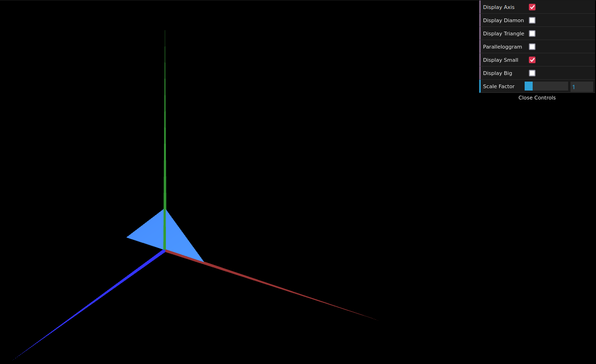
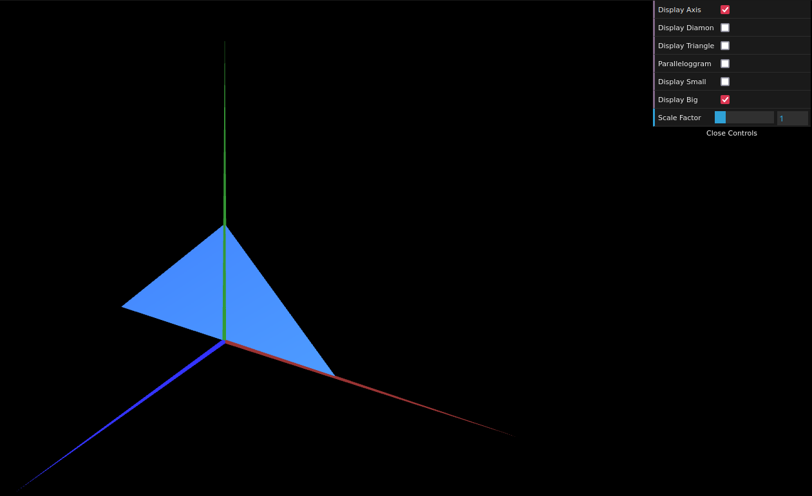

# CG 2024/2025

## Group T03G02

## TP 1 Notes

### Exercise 1

- In exercise 1, we started by familiarising ourselves with the given code, understanding how to display a simple 2D geometric shape in a 3D environment by combining triangles due to being the simplest shapes, as well as how to create a checkbox that would toogle the display for the axis

- When drawing the triangle in exercise 1 we learned that the order in which the reference of vertices were given either displayed them front-facing towards the camera (counter-clockwise) or back-facing (clockwise)

- When drawing the parallelogram we learned that in order to display a shape both towards and against the camera, two different references of vertices had to be given, one counter-clockwise and another clockwise

****

### Exercise 2

- In exercise 2, we consolidated our knowledge by creating and displaying two triangles, one small and one big as shown by the following images:

#### Small Triangle

****

#### Big Triangle

