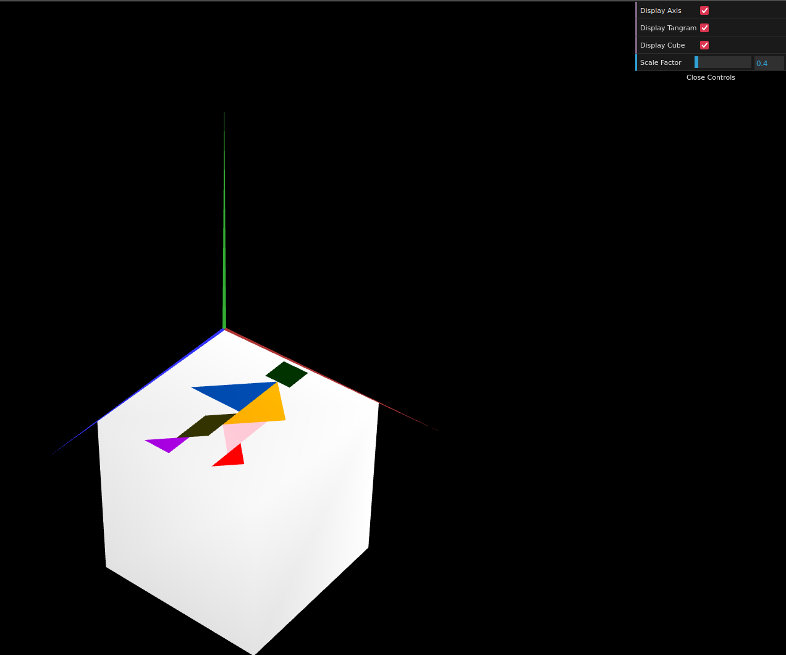
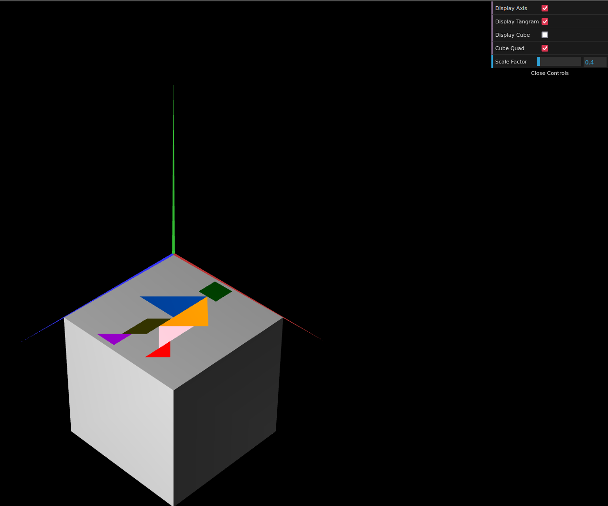

# CG 2024/2025

## Group T03G02

## TP 2 Notes

### Exercise 1

- In exercise 1, we learned how to apply colors using `CGFappearance`, as well as how to display and apply transformations to an object composed of multiple objects using `pushMatrix`, `popMatrix`, and the WebCGF geometric transformation functions (`translate`, `scale`, `rotate`)

- We also learned that the order in which we use the transformation functions matters and that we should use them in **reverse** of the spoken order

#### Tangram side by side comparison:

### Exercise 2

- In exercise 2, we consolidated our knowledge of creating front and backfacing shapes, as well as transformations, by creating a unit cube and applying to it the requested tranformations

#### Tangram and unit cube after requested transformations:

### Exercise 3

- In exercise 3, we learned that it is also possible to create a complex shape by using a repeating smaller shape within it and apply the necessary transformations until the complex shape is created, instead of having to place and connect every single vertex of the complex shape

- We also noticed that lighting seems to affect a shape differently when its made of smaller shapes instead of a singular complex shape

#### Tangram and unit cube quad

