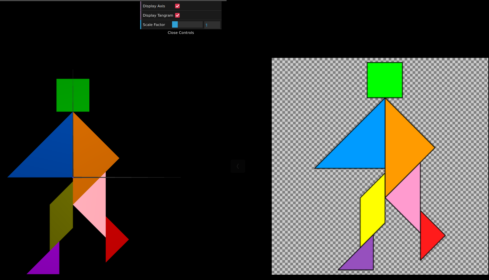

# CG 2024/2025

## Group T03G02

## TP 2 Notes

### Exercise 1

- In exercise 1, we learned how to apply colors using `CGFappearance`, as well as how to display and apply transformations to an object composed of multiple objects using `pushMatrix`, `popMatrix`, and the WebCGF geometric transformation functions (`translate`, `scale`, `rotate`)

- We also learned that the order in which we use the transformation functions matters and that we should use them in **reverse** of the spoken order

#### Tangram side by side comparison:

