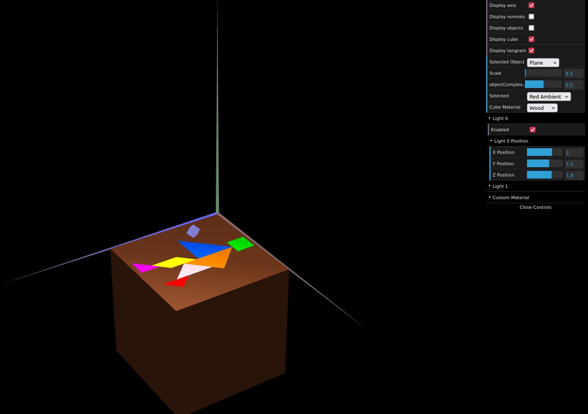
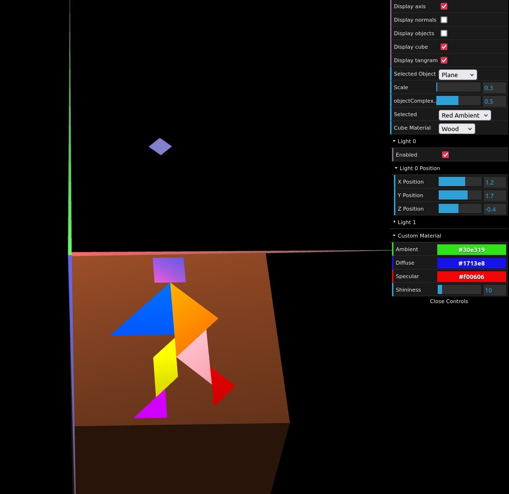

# CG 2024/2025

## Group T03G02

## TP 3 Notes

### Exercise 1

- In exercise 1, we consolidated our knowledge about lighting in WebCGF (ambient, diffuse, and specular).
- For this application, different numbers of normals were used to reflect the behavior of light on different planes (creating identical points with different normals).
- Additionally, different materials were applied to the objects, resulting in different behaviors of the various types of light.

#### Cube with wood material:

#### Diamond with custom material:

### Exercise 2

- In exercise 2, we learned how to create complex shapes with multiple variating vertexes, using `for` loops and `variables` instead of fixed coordinates.

#### Octogonal Prism

