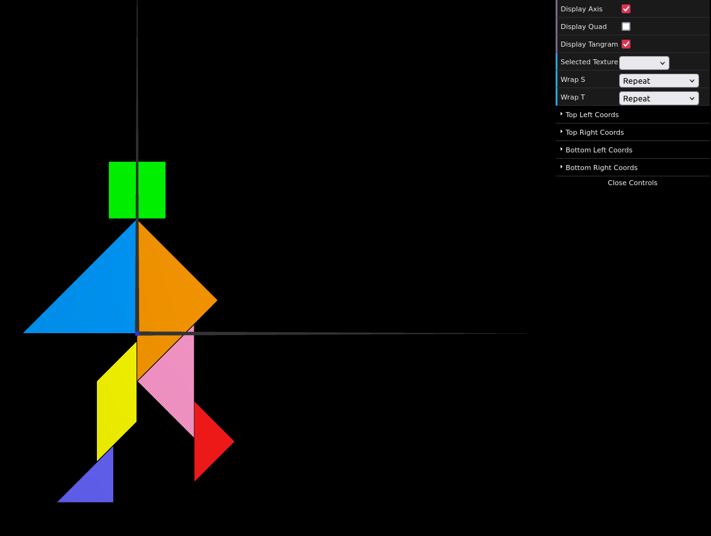
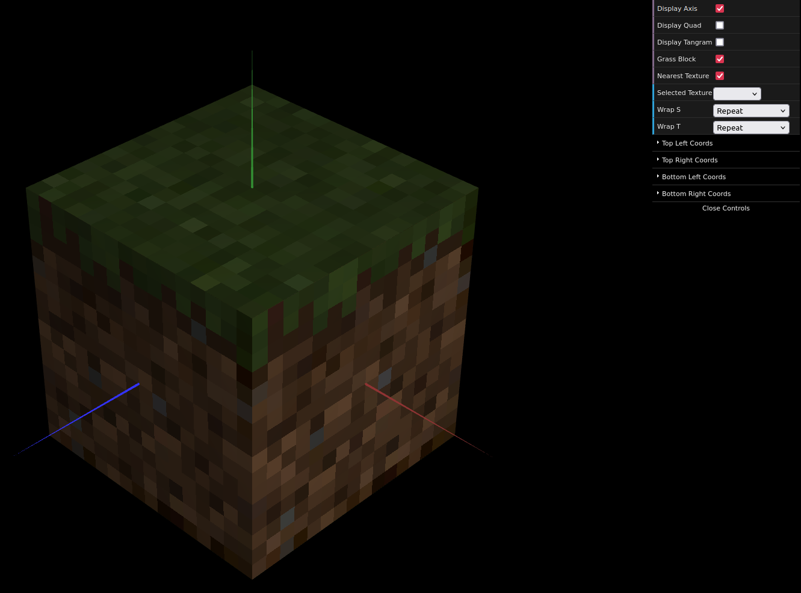

# CG 2024/2025

## Group T03G02

## TP 4 Notes

### Preparation

- In the preparation experiments, we learned how texture mapping is represented in WebCGF using the S and T axis
- We also learned of the different texture wrapping methods and what they consisted in

### Exercise 1

- In exercise 1, we learned how to use textures coordinates in order to attribute a specific part of a texture to an object in WebCGF

#### Tangram with textures:

### Exercise 2

- In exercise 2, we learned how different texture parameters influence how a colour is sellected for each pixel

#### Dirt Block:

