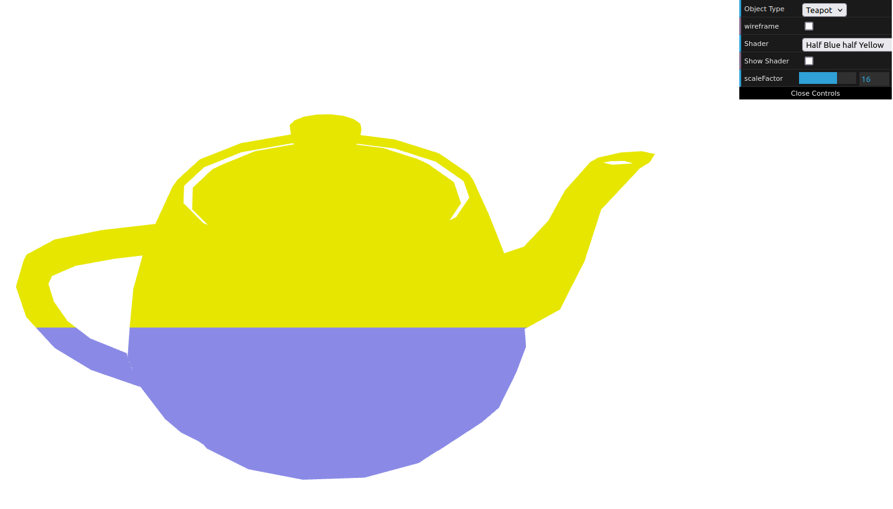
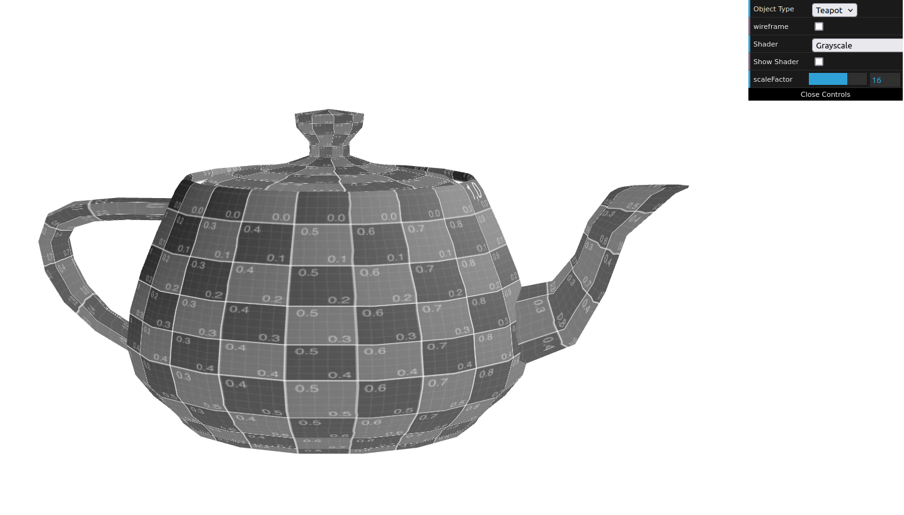
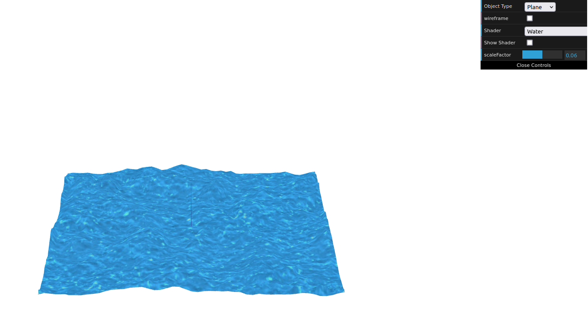

# CG 2024/2025

## Group T03G02

## TP 4 Notes

### Preparation

- In the preparation experiments, we learned how texture mapping is represented in WebCGF using the S and T axis
- We also learned of the different texture wrapping methods and what they consisted in

### Exercise 1

- In exercise 1, we learned about the variable types used in shaders (attribute, uniform, variable) and how they work using them to alter color in regards to the position of the vertex

#### Half Blue Half Yellow:

#### Grayscale:

### Exercise 2

- In exercise 2, we learned how to pass textures along to the shader, so as to sample them and alter the values of the vertices according to the sample obtained

#### Water Waves:

